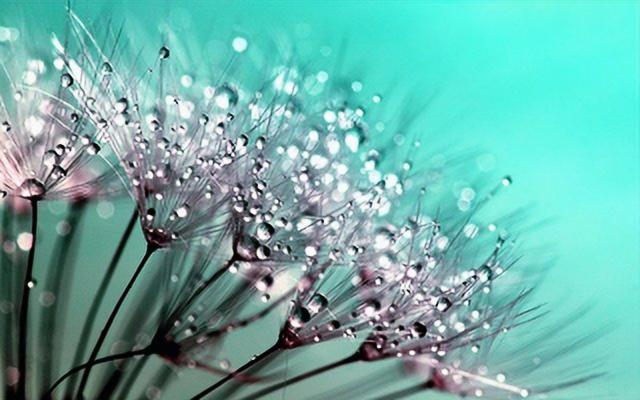

# Upscale
Image Super resolution using Generative Adversial Network, upscales the image by 2x with an average noted ssim = 0.91

<table>
<thead></thead>
<tbody>
<tr>
<td>Original Image</td><td>2x Upscaled Image </td>
</tr>
<tr>
<td></td><td></td>
</tr>
<tr>
<td></td><td align='center'>psnr: 29.59 &nbsp; ssim: 0.936</td>
</tr>
</tbody>
</table>

## Getting Started
Clone or download the project to your system

<h4>Prequisites</h4>

Python
<pre>Install Python 3 or Anaconda</pre>

<h4>Installing</h4>

Install Dependencies

<pre>pip install tensorflow Pillow scikit-image</pre>
 
<h4>Running</h4>

GAN.py - GAN network used to train and generate the model
<pre>python GAN.py</pre>

Generate.py - Generates 2x upscaled image
<pre>python Generate.py</pre>
